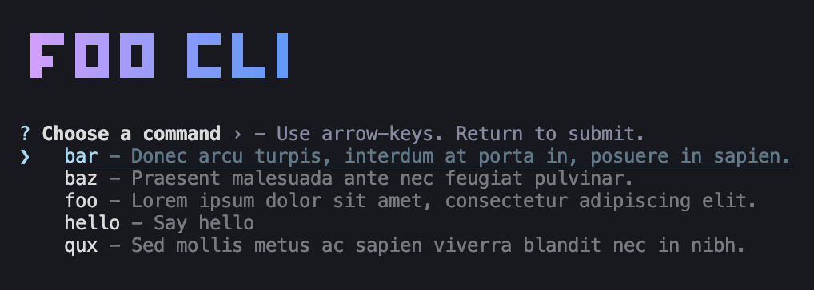
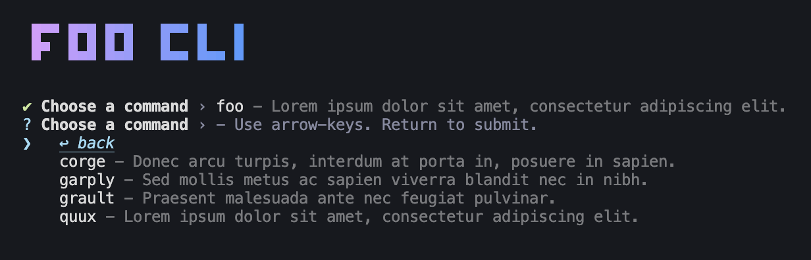

# Clide-JS Command Menu Plugin

A Clide-JS plugin that prompts the user to select a subcommand when required.

```ts
import { run } = from 'clide-js';
import { commandMenu } = from 'clide-plugin-command-menu';

run({
  plugins: [
    commandMenu({
      title: 'Foo CLI',
      titleColors: ['#D89DFF', '#519BFF'],
    })
  ],
});
```



After the user selects a subcommand, the command will be resolved and if it
also requires a subcommand, the user will be prompted again, but this time
can also select `↩ back` to go back to the previous menu. This will continue
until the user has selected all required subcommands.


